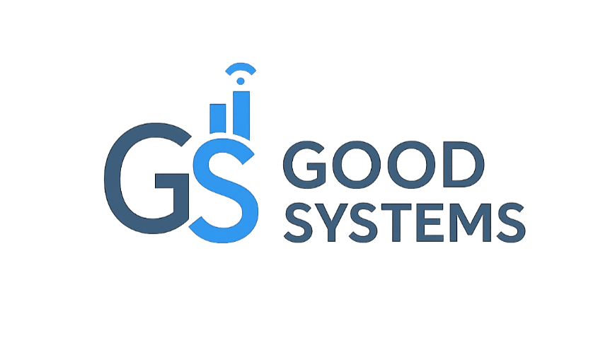
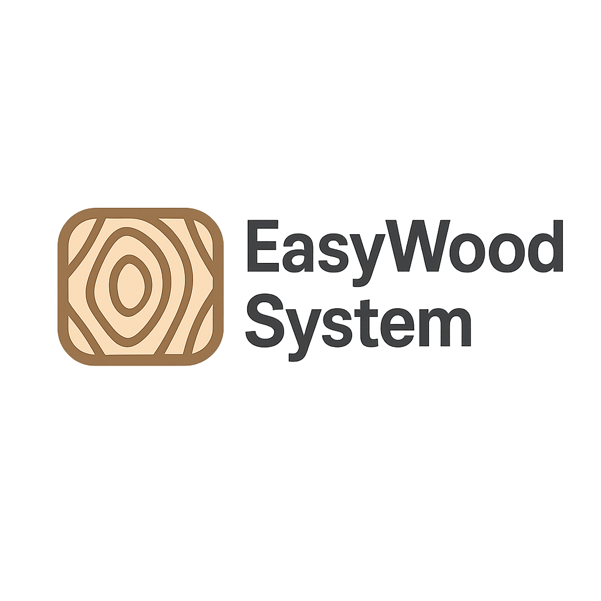
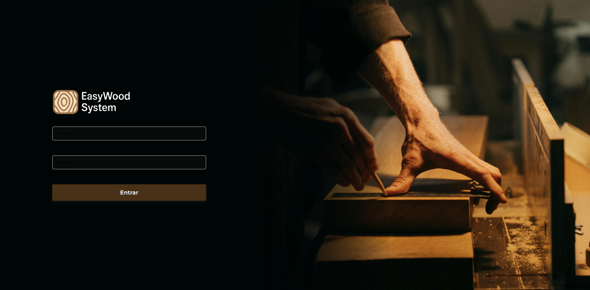
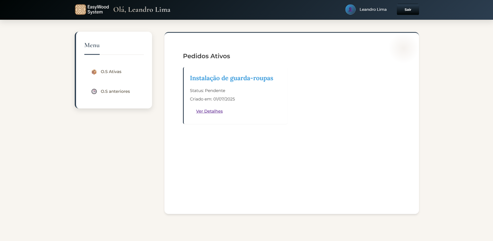
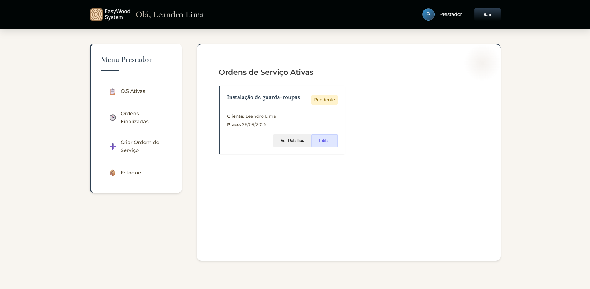
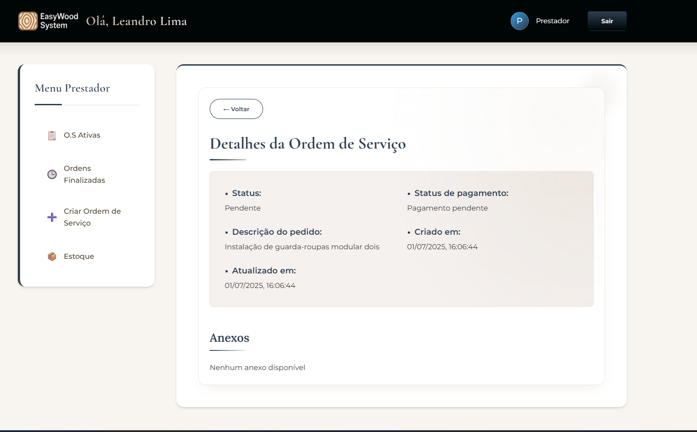
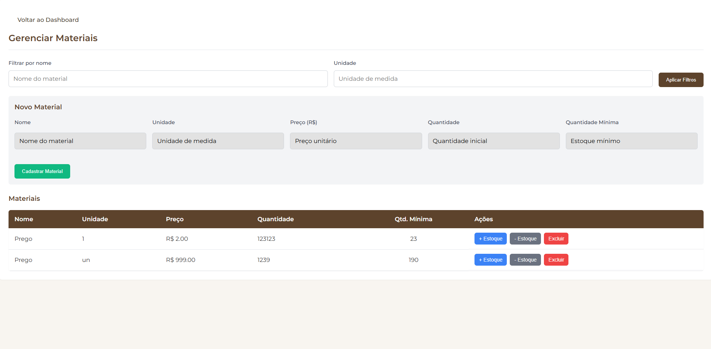

# EasyWood System 📐🪚

**Solução de gestão para marcenarias e pequenas empresas do setor moveleiro**

<div style="display: flex; align-items: center; justify-content: center">


</div>

## 🚀 Sobre

O **EasyWood System** é um aplicativo web desenvolvido como projeto integrador do curso de Desenvolvimento de Software Multiplataforma na FATEC Araras. Voltado para marcenarias, oferece controle de ordens de serviço, pagamentos, estoque e acompanhamento em tempo real pelo cliente.

Está sendo construído como uma API RESTful utilizando **Laravel** no backend, para oferecer uma base sólida, escalável e segura.
O frontend será desenvolvido separadamente, utilizando uma tecnologia moderna a ser definida futuramente (React, Vue, Angular, ou outra).

Estruturação permitirá maior flexibilidade, facilitando a integração com múltiplos clientes (web, mobile) e melhor manutenção do código.

---

## ✨ Funcionalidades Principais

- **Cadastro e Login**: Autenticação segura para comerciantes e clientes.
- **Ordens de Serviço**: Criação, atualização de status e histórico de serviços.
- **Gestão Financeira**: Controle de pagamentos.
- **Controle de Estoque**: Monitoramento de itens, alertas de estoque baixo.
- **Anexos**: Upload de fotos, vídeos e arquivos de projeto.
- **Painel do Cliente**: Acompanhamento em tempo real do progresso das ordens.

---

## 🛠️ Tecnologias Utilizadas

- **Frontend:** React, Vue, ou outra tecnologia
- **Backend:** PHP/Laravel
- **Banco de Dados:** MySQL
- **Controle de Versão:** Git & GitHub

---

## 📸 Capturas de Tela

Veja abaixo algumas telas do sistema em funcionamento:

### 🔐 Tela de Login



### 📋 Dashboard Cliente



### 💰 Dashboard Prestador



### 🧾 Tela de Detalhes do Pedido



### 📦 Controle de Estoque



---

## 📚 Documentação

A documentação completa do projeto estará disponível na pasta `docs/`. Para ver detalhes de instalação avançada, diagramas e manuais de uso.

---

## ⚙️ Instalação


### 1. Clone o repositório

```bash
git clone https://github.com/willsf2021/Projeto-Integrador-2-SEM.git
cd Projeto-Integrador-2-SEM
```

---

### 2. Instale as dependências

#### Backend (Laravel API)

```bash
cd easyWoodApi
composer install
cp .env.example .env
php artisan key:generate
```

Edite o arquivo `.env` com suas configurações do banco de dados:

```env
DB_CONNECTION=mysql
DB_HOST=127.0.0.1
DB_PORT=3306
DB_DATABASE=easywood_db
DB_USERNAME=root
DB_PASSWORD=
```

Depois, execute as migrações:

```bash
php artisan migrate
```

Inicie o servidor da API:

```bash
php artisan serve
```

A API estará disponível em: `http://localhost:8000`

---

#### Frontend (React)

Abra outro terminal e vá para a pasta do frontend:

```bash
cd ../easyWoodFront
npm install
```

Altere o arquivo easyWoodFront/src/services/api.js na variável 'baseURL' com a URL da API:

```javascript
const api = axios.create({
  baseURL: "http://localhost:8000/api", // Aqui
  headers: {
    "Content-Type": "application/json",
  },
});
```

Inicie o servidor de desenvolvimento:

```bash
npm run dev
```

A aplicação estará disponível em: `http://localhost:5173`

---

## 📝 Uso

- Crie uma conta como comerciante ou cliente.
- Como comerciante, cadastre produtos, ordens de serviço e gerencie pagamentos.
- Como cliente, consulte o status e histórico das suas ordens.

---

## 🤝 Contribuição

1. Fork este repositório
2. Crie uma branch: `feature/nome-da-feature`
3. Commit suas alterações: `git commit -m "feat: descrição da feature"`
4. Push na branch: `git push origin feature/nome-da-feature`
5. Abra um Pull Request

---

## 👥 Equipe

- **Tiago Bertoline**
- **Wilson G. D. Pereira Júnior**

---

## 📄 Licença

Este projeto está sob a licença MIT. Veja o arquivo [LICENSE](LICENSE) para mais detalhes.

---

> Desenvolvido por Good Systems – FATEC Araras 2025
